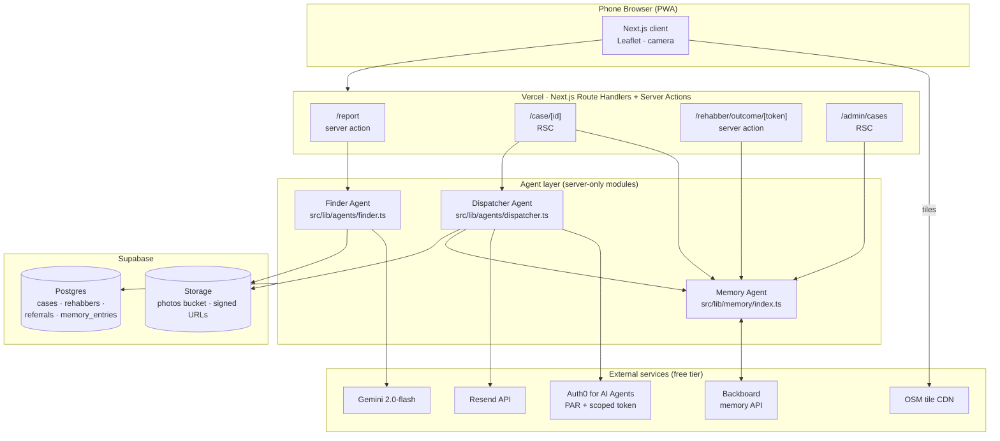

# Architecture

Terra Triage is a mobile-first Next.js PWA with three cooperating agent roles. All state lives in Supabase (Postgres + Storage). No backend server beyond Next.js route handlers and server actions.

## Mermaid



## ASCII

```
                     ┌─────────────────────────────────────┐
                     │  Phone Browser (PWA, 375px-first)   │
                     │  Next.js client · Leaflet · camera  │
                     └──────┬───────────────────────┬──────┘
                            │ HTTPS                 │ tile GET
                            ▼                       ▼
                ┌─────────────────────────┐   ┌───────────────┐
                │  Vercel Edge / Node     │   │ OSM tile CDN  │
                │  Next.js Route Handlers │   └───────────────┘
                │  + Server Actions       │
                └────┬────────┬────────┬──┘
          intake    │        │        │  dispatch / outcome
                    ▼        ▼        ▼
         ┌──────────────┐ ┌──────────────┐ ┌──────────────────┐
         │ Finder Agent │ │ Memory Agent │ │ Dispatcher Agent │
         │  (Gemini)    │ │ (Backboard)  │ │ (Auth0 + Resend) │
         └──────┬───────┘ └──────┬───────┘ └────────┬─────────┘
                │                │                  │
                ▼                ▼                  ▼
         ┌──────────┐     ┌────────────┐     ┌─────────────┐
         │ Gemini   │     │ Backboard  │     │ Auth0 for   │
         │ 2.0-flash│     │ Memory API │     │ AI Agents   │
         └──────────┘     └────────────┘     └──────┬──────┘
                                                    │ scoped token
                                                    ▼
                                             ┌─────────────┐
                                             │ Resend API  │
                                             └─────────────┘

                ┌──────────────────────────────────────────┐
                │  Supabase (Postgres + Storage + RLS)     │
                │  cases · rehabbers · referrals ·         │
                │  memory_entries · photos bucket          │
                └──────────────────────────────────────────┘
                             ▲  all agents read/write through RLS
```

## Case state machine

```
new ──(finder)──▶ triaged ──(dispatcher)──▶ referred ──(outcome.accepted)──▶ accepted
                                                │
                                                └─(outcome.declined)──▶ referred (open to other rehabbers)
                                                └─(outcome.transferred|closed)──▶ closed
```

Enforced via a Postgres `CHECK` constraint on `cases.status`. See `supabase/migrations/`.

## Key data flow — Backboard memory loop

1. `/case/[id]` calls `rankRehabbersWithMemory(caseInput, rehabbers)` which:
   - pulls `capacity`, `accept_rate`, `species_scope`, `response_ms`, `geo_accuracy` for all candidate rehabbers in one `getMemory().query(ids)` call.
   - feeds those signals into the Phase-5 weighted scorer (0.35 species / 0.25 distance / 0.20 capacity / 0.15 accept / 0.05 response).
2. User consents → Dispatcher sends the email → `referrals` row written with `rank_explain` pinned from the *above* ranking (anti-tamper: rehabber must be top-5).
3. Rehabber clicks magic-link → `/rehabber/outcome/[token]` submits an outcome → `applyOutcomeToSignals(prev, outcome, opts)` reduces into upsert entries → `getMemory().upsert(...)` writes to Backboard (mirrored to `memory_entries`).
4. Next case for the same species shows a different top-3 in `/admin/cases` → **Backboard prize moment**.

## Non-goals

Queues, microservices, Docker, paid APM, native apps, payment processing, government permit verification, real-time video/chat. See `PRD.md` §6.3.
